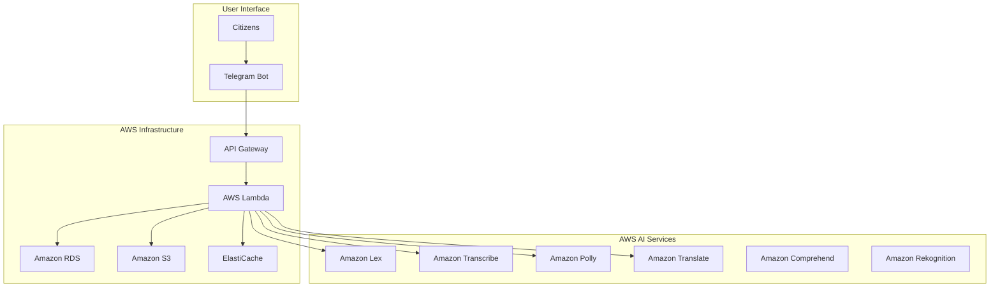

# 🏛️ AI Civic Helpdesk for Government Services

> **Empowering Citizens Through AI-Powered Government Service Access**

[](https://aws.amazon.com/)
[](https://telegram.org/)
[](https://aws.amazon.com/ai/)
[](https://aiforabharat.org/)

## 🎯 Project Overview

The **AI Civic Helpdesk** is an intelligent Telegram bot that democratizes access to government services in India by providing multilingual, AI-powered assistance for citizens navigating complex bureaucratic processes.

### 🚀 Key Features

- **🗣️ Multilingual Support**: 10+ Indian languages with real-time translation
- **🤖 AI-Powered Conversations**: Natural language understanding for government queries
- **📱 Telegram Integration**: Accessible through India's most popular messaging platform
- **🔊 Voice Capabilities**: Speech-to-text and text-to-speech for accessibility
- **📄 Document Assistance**: AI-powered document verification and requirement checking
- **🎯 Eligibility Checker**: Personalized government scheme recommendations
- **🏢 Office Locator**: Find nearest government offices and services
- **💰 Fee Information**: Transparent pricing and subsidy scheme details

## 🏗️ Architecture Overview



## 🛠️ Technology Stack

### **AWS-Powered Backend**
- **🧠 AI/ML**: Amazon Lex, SageMaker, Comprehend, Rekognition
- **🗣️ Speech**: Amazon Transcribe, Amazon Polly
- **🌐 Translation**: Amazon Translate (10+ Indian languages)
- **⚡ Compute**: AWS Lambda (Serverless)
- **🗄️ Storage**: Amazon RDS (PostgreSQL), Amazon S3
- **🚀 Performance**: Amazon ElastiCache, CloudFront CDN
- **🔗 Integration**: AWS API Gateway, EventBridge

### **Frontend & Integration**
- **📱 Platform**: Telegram Bot API with Telegraf.js
- **🎨 Admin Dashboard**: React.js on AWS Amplify
- **🔐 Security**: AWS WAF, Shield, KMS encryption
- **📊 Monitoring**: CloudWatch, X-Ray distributed tracing

## 📋 Quick Start

### Prerequisites
- AWS Account with appropriate permissions
- Telegram Bot Token from [@BotFather](https://t.me/botfather)
- Node.js 18+ and npm/yarn

### Installation

1. **Clone the repository**
   ```bash
   git clone https://github.com/sairishigangarapu/Hack_2_skill.git
   cd Hack_2_skill
   ```

2. **Install dependencies**
   ```bash
   npm install
   ```

3. **Configure AWS services**
   ```bash
   # Set up AWS credentials
   aws configure
   
   # Deploy infrastructure
   npm run deploy:aws
   ```

4. **Set environment variables**
   ```bash
   cp .env.example .env
   # Edit .env with your Telegram bot token and AWS configuration
   ```

5. **Start the bot**
   ```bash
   npm run start
   ```

## 🎮 Usage

### For Citizens

1. **Start the bot**: Search for `@AIGovHelpBot` on Telegram
2. **Choose language**: Select from 10+ Indian languages
3. **Ask questions**: Type or speak your government service queries
4. **Get assistance**: Receive step-by-step guidance and document checklists
5. **Find offices**: Get locations and contact information for government offices

### Bot Commands

```
/start - Initialize bot and select language
/help - Show available commands and features
/services - Browse government services by category
/eligibility - Check eligibility for government schemes
/documents - Get document requirements for services
/fees - View fee information and payment schemes
/offices - Find nearby government offices
/language - Change your preferred language
/feedback - Provide feedback to improve the service
```

## 📊 Project Structure

```
├── 📁 src/
│   ├── 📁 bot/           # Telegram bot implementation
│   ├── 📁 ai/            # AWS AI service integrations
│   ├── 📁 database/      # Database models and migrations
│   ├── 📁 services/      # Business logic and external APIs
│   └── 📁 utils/         # Helper functions and utilities
├── 📁 infrastructure/    # AWS CDK/CloudFormation templates
├── 📁 docs/             # Documentation and guides
│   ├── requirements.md   # Detailed technical requirements
│   └── design.md        # System architecture and design
├── 📁 tests/            # Unit and integration tests
└── 📄 README.md         # This file
```

## 🎯 Problem Statement

Citizens in India face significant challenges accessing government services due to:

- **Information Gaps**: Lack of clear guidance on application processes
- **Language Barriers**: Complex procedures explained only in English/Hindi
- **Document Confusion**: Unclear requirements for various services
- **Middleman Dependency**: Reliance on agents leading to corruption
- **Accessibility Issues**: Limited access for rural and less-educated citizens

## 💡 Our Solution

The AI Civic Helpdesk addresses these challenges by providing:

- **🎯 Simplified Access**: Easy-to-understand explanations in local languages
- **🤖 24/7 Availability**: Round-the-clock assistance without human intervention
- **📱 Mobile-First**: Accessible through Telegram on any smartphone
- **🔍 Intelligent Search**: AI-powered service discovery and recommendations
- **📋 Step-by-Step Guidance**: Clear instructions for each government process
- **🏢 Office Integration**: Direct connections to government service centers

## 🌟 Impact & Benefits

### For Citizens
- **⏰ Time Savings**: Reduce multiple visits to government offices
- **💰 Cost Reduction**: Eliminate dependency on middlemen and agents
- **🎯 Better Access**: Equal access regardless of education or location
- **🔍 Transparency**: Clear information about fees, timelines, and processes

### For Government
- **📈 Efficiency**: Reduced workload on government helpdesks
- **📊 Data Insights**: Analytics on citizen service usage patterns
- **🎯 Better Service Delivery**: Improved citizen satisfaction scores
- **💻 Digital India**: Advancement of digital governance initiatives

## 🏆 AWS Advantages

### **Government-Ready Infrastructure**
- ✅ **Compliance**: FISMA, FedRAMP, SOC certifications
- ✅ **Security**: Enterprise-grade encryption and access controls
- ✅ **Reliability**: 99.99% uptime SLA with multi-AZ deployment
- ✅ **Scalability**: Handle millions of citizens without infrastructure concerns

### **AI/ML Excellence**
- ✅ **Pre-trained Models**: Optimized for Indian languages and contexts
- ✅ **Custom Training**: SageMaker for government-specific use cases
- ✅ **Cost Efficiency**: Pay-per-use pricing model perfect for government budgets
- ✅ **Integration**: Seamless connectivity between AI services

## 📈 Roadmap

### Phase 1: MVP (Weeks 1-6)
- [x] Basic Telegram bot with AWS Lambda
- [x] Amazon Lex integration for English/Hindi
- [x] Core government services database
- [x] Basic document verification

### Phase 2: Enhanced Features (Weeks 7-14)
- [ ] Voice processing with Transcribe/Polly
- [ ] Multi-language support (10+ languages)
- [ ] Advanced AI recommendations
- [ ] Rich media responses

### Phase 3: Advanced Integration (Weeks 15-22)
- [ ] Government API integrations
- [ ] Real-time application tracking
- [ ] Advanced analytics dashboard
- [ ] Performance optimization

### Phase 4: Scale & Deploy (Weeks 23-26)
- [ ] Production deployment
- [ ] Load testing and optimization
- [ ] Security auditing
- [ ] User training and documentation

## 🤝 Contributing

We welcome contributions from the community! Please see our [Contributing Guidelines](CONTRIBUTING.md) for details.

### Development Setup

1. Fork the repository
2. Create a feature branch: `git checkout -b feature/amazing-feature`
3. Commit your changes: `git commit -m 'Add amazing feature'`
4. Push to the branch: `git push origin feature/amazing-feature`
5. Open a Pull Request

## 📄 Documentation

- **[📋 Requirements](requirements.md)**: Detailed technical requirements and specifications
- **[🏗️ Design](design.md)**: System architecture and implementation details
- **[🔧 API Documentation](docs/api.md)**: API endpoints and integration guides
- **[🚀 Deployment Guide](docs/deployment.md)**: Step-by-step deployment instructions

## 🏅 Team

**Team Hack_2_Skill** - AI for Bharat Hackathon 2024

- **Project Lead**: [Sai Rishi Gangarapu](https://github.com/sairishigangarapu)
- **AI/ML Engineer**: [Team Member 2]
- **Backend Developer**: [Team Member 3]
- **Frontend Developer**: [Team Member 4]

## 📞 Support

- **📧 Email**: support@aicivichelpdesk.gov.in
- **💬 Telegram**: [@AIGovHelpBot](https://t.me/AIGovHelpBot)
- **🐛 Issues**: [GitHub Issues](https://github.com/sairishigangarapu/Hack_2_skill/issues)
- **📖 Documentation**: [Project Wiki](https://github.com/sairishigangarapu/Hack_2_skill/wiki)

## 📜 License

This project is licensed under the MIT License - see the [LICENSE](LICENSE) file for details.

## 🙏 Acknowledgments

- **AWS for Bharat**: For providing the platform and infrastructure support
- **Government of India**: For Digital India initiatives and open data policies
- **Telegram**: For providing an accessible messaging platform
- **Open Source Community**: For the amazing tools and libraries that made this possible

---

<div align="center">

**🚀 Built with ❤️ for Digital India 🇮🇳**

*Empowering every citizen with equal access to government services*

[🌟 Star this repo](https://github.com/sairishigangarapu/Hack_2_skill) | [🍴 Fork it](https://github.com/sairishigangarapu/Hack_2_skill/fork) | [📢 Share it](https://twitter.com/intent/tweet?text=Check%20out%20this%20amazing%20AI%20Civic%20Helpdesk%20project!&url=https://github.com/sairishigangarapu/Hack_2_skill)

</div>
