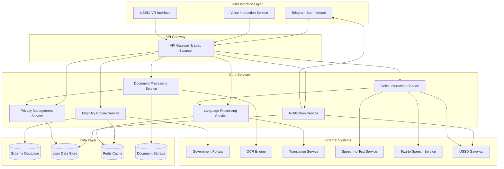

# Design Document: Government Scheme Access Assistant

## Overview

The Government Scheme Access Assistant is a privacy-first Telegram bot that democratizes access to government welfare schemes for India's underserved populations. The system employs a microservices architecture with local document processing, intelligent eligibility matching, and multi-lingual support to guide users through scheme discovery and application processes.

The design prioritizes data privacy, regulatory compliance, and accessibility while maintaining high performance and scalability. The bot processes user documents locally, extracts relevant information for scheme matching, and provides personalized recommendations with step-by-step application guidance.

## Architecture

The system follows a microservices architecture with clear separation of concerns, enabling independent scaling and maintenance of different components.



### Architectural Principles

1. **Privacy by Design**: All sensitive data processing occurs locally with minimal external API calls
2. **Microservices**: Independent, scalable services with well-defined interfaces
3. **Event-Driven**: Asynchronous processing for document analysis and notifications
4. **Caching Strategy**: Multi-layer caching for scheme data and user sessions
5. **Graceful Degradation**: Offline capabilities and fallback mechanisms
6. **Compliance First**: Built-in privacy controls and audit logging

## Components and Interfaces

### Telegram Bot Interface

The primary user interaction layer that handles all Telegram-specific communication protocols.

**Responsibilities:**
- Message routing and session management
- File upload handling and validation
- User authentication and rate limiting
- Webhook management for real-time updates

**Key Interfaces:**
```typescript
interface TelegramBotService {
  handleMessage(update: TelegramUpdate): Promise<void>
  sendMessage(chatId: string, message: LocalizedMessage): Promise<void>
  handleDocument(chatId: string, document: TelegramDocument): Promise<void>
  setWebhook(url: string): Promise<boolean>
}
```

### Document Processing Service

Handles document upload, OCR processing, and information extraction with privacy protection.

**Responsibilities:**
- Image preprocessing and quality validation
- OCR text extraction from government documents
- Information parsing and structured data extraction
- PII masking and privacy protection
- Document type classification

**Key Interfaces:**
```typescript
interface DocumentProcessor {
  processDocument(document: UploadedDocument): Promise<ExtractedInfo>
  validateDocumentQuality(image: Buffer): Promise<QualityScore>
  extractAadhaarInfo(ocrText: string): Promise<AadhaarInfo>
  extractRationCardInfo(ocrText: string): Promise<RationCardInfo>
  extractIncomeInfo(ocrText: string): Promise<IncomeInfo>
}
```

### Eligibility Engine Service

Core business logic for scheme matching and eligibility assessment.

**Responsibilities:**
- Rule-based eligibility evaluation
- ML-driven scheme recommendations
- Eligibility scoring and ranking
- Scheme criteria validation
- User profile analysis

**Key Interfaces:**
```typescript
interface EligibilityEngine {
  evaluateEligibility(profile: UserProfile): Promise<EligibilityResult[]>
  rankSchemes(schemes: SchemeMatch[]): Promise<RankedScheme[]>
  checkPartialEligibility(profile: UserProfile, scheme: Scheme): Promise<PartialMatch>
  suggestImprovements(profile: UserProfile): Promise<Suggestion[]>
}
```

### Language Processing Service

Handles multi-lingual communication and content localization.

**Responsibilities:**
- Language detection and preference management
- Content translation and localization
- Voice-to-text processing
- Cultural adaptation of messaging
- Technical term simplification

**Key Interfaces:**
```typescript
interface LanguageProcessor {
  detectLanguage(text: string): Promise<LanguageCode>
  translateContent(content: string, targetLang: LanguageCode): Promise<string>
  processVoiceMessage(audio: Buffer): Promise<string>
  simplifyTechnicalTerms(text: string, lang: LanguageCode): Promise<string>
}
```

### Voice Interaction Service

Handles comprehensive voice-based interactions including speech recognition, synthesis, and conversational AI.

**Responsibilities:**
- Speech-to-text conversion in multiple Indian languages
- Text-to-speech synthesis with regional accents
- Voice command processing and intent recognition
- Audio quality assessment and enhancement
- Voice-based document reading assistance
- Conversational flow management for voice interactions

**Key Interfaces:**
```typescript
interface VoiceInteractionService {
  speechToText(audio: Buffer, language: LanguageCode): Promise<TranscriptionResult>
  textToSpeech(text: string, language: LanguageCode, voice: VoiceProfile): Promise<Buffer>
  processVoiceCommand(audio: Buffer): Promise<VoiceCommand>
  enhanceAudioQuality(audio: Buffer): Promise<Buffer>
  readDocumentAloud(document: ProcessedDocument, language: LanguageCode): Promise<Buffer>
  manageVoiceConversation(sessionId: string, audio: Buffer): Promise<VoiceResponse>
}

interface TranscriptionResult {
  text: string
  confidence: number
  language: LanguageCode
  alternativeTranscriptions: string[]
  audioQuality: QualityScore
}

interface VoiceCommand {
  intent: CommandIntent
  parameters: Record<string, any>
  confidence: number
  requiresConfirmation: boolean
}

interface VoiceResponse {
  audioResponse: Buffer
  textResponse: string
  followUpPrompt?: string
  requiresUserInput: boolean
}
```

### Privacy Management Service

Ensures data protection compliance and privacy controls.

**Responsibilities:**
- PII identification and masking
- Data retention policy enforcement
- Audit logging and compliance reporting
- User consent management
- Data deletion and anonymization

**Key Interfaces:**
```typescript
interface PrivacyManager {
  maskSensitiveData(data: ExtractedInfo): Promise<MaskedInfo>
  enforceRetentionPolicy(): Promise<void>
  logDataAccess(userId: string, operation: string): Promise<void>
  deleteUserData(userId: string): Promise<boolean>
  anonymizeData(data: UserData): Promise<AnonymizedData>
}
```

### Notification Service

Manages user communications, reminders, and follow-ups.

**Responsibilities:**
- Scheduled notification delivery
- Follow-up reminder management
- Notification preference handling
- Message queuing and retry logic
- Delivery status tracking

**Key Interfaces:**
```typescript
interface NotificationService {
  scheduleReminder(userId: string, reminder: ReminderConfig): Promise<string>
  sendFollowUp(userId: string, application: Application): Promise<void>
  updatePreferences(userId: string, prefs: NotificationPrefs): Promise<void>
  cancelScheduledNotifications(userId: string): Promise<void>
}
```

## Data Models

### User Profile Model

Represents extracted and processed user information for eligibility assessment.

```typescript
interface UserProfile {
  userId: string
  personalInfo: {
    name: string
    age: number
    gender: Gender
    maskedAadhaar: string // Only last 4 digits
  }
  addressInfo: {
    state: string
    district: string
    pincode: string
    ruralUrban: LocationType
  }
  familyInfo: {
    familySize: number
    dependents: number
    rationCardType: RationCardType
    maskedRationCard: string
  }
  economicInfo: {
    annualIncome: number
    incomeSource: IncomeSource
    belowPovertyLine: boolean
  }
  preferences: {
    language: LanguageCode
    notificationFrequency: NotificationFrequency
    communicationMode: CommunicationMode // Text, Voice, Both
    voicePreferences?: {
      preferredVoice: VoiceProfile
      speechRate: SpeechRate
      enableVoiceConfirmation: boolean
      autoPlayResponses: boolean
    }
  }
  createdAt: Date
  lastUpdated: Date
  dataRetentionExpiry: Date
}
```

### Scheme Model

Represents government scheme information and eligibility criteria.

```typescript
interface Scheme {
  schemeId: string
  name: LocalizedString
  description: LocalizedString
  category: SchemeCategory
  level: GovernmentLevel // Central, State, District
  state?: string // For state-specific schemes
  
  eligibilityCriteria: {
    ageRange?: { min: number, max: number }
    genderRestriction?: Gender
    incomeLimit?: number
    locationRestriction?: LocationCriteria
    familySizeLimit?: number
    rationCardTypes?: RationCardType[]
    customCriteria?: CustomCriterion[]
  }
  
  benefits: {
    type: BenefitType
    amount?: number
    description: LocalizedString
    duration?: string
  }
  
  applicationProcess: {
    requiredDocuments: DocumentType[]
    steps: ApplicationStep[]
    onlinePortal?: string
    offlineProcess?: string
    processingTime: string
  }
  
  isActive: boolean
  lastUpdated: Date
  source: string // Government portal URL
}
```

### Application Tracking Model

Tracks user applications and their progress through the system.

```typescript
interface Application {
  applicationId: string
  userId: string
  schemeId: string
  status: ApplicationStatus
  
  progress: {
    currentStep: number
    totalSteps: number
    completedSteps: ApplicationStep[]
    nextAction: string
    deadline?: Date
  }
  
  documents: {
    submitted: SubmittedDocument[]
    pending: DocumentType[]
    verified: boolean
  }
  
  timeline: {
    initiated: Date
    lastActivity: Date
    submitted?: Date
    approved?: Date
    rejected?: Date
  }
  
  followUps: {
    scheduled: ScheduledReminder[]
    completed: CompletedFollowUp[]
  }
  
  outcome?: {
    result: ApplicationResult
    reason?: string
    benefitAmount?: number
    enrollmentId?: string
  }
}
```

### Document Processing Model

Represents processed document information with privacy protection.

```typescript
interface ProcessedDocument {
  documentId: string
  userId: string
  documentType: DocumentType
  
  metadata: {
    originalFilename: string
    fileSize: number
    uploadedAt: Date
    processingStatus: ProcessingStatus
  }
  
  extractedInfo: {
    confidence: number
    rawText?: string // Temporarily stored for processing
    structuredData: Record<string, any>
    validationErrors: ValidationError[]
  }
  
  privacy: {
    piiMasked: boolean
    retentionExpiry: Date
    accessLog: AccessLogEntry[]
  }
  
  qualityMetrics: {
    imageQuality: QualityScore
    ocrConfidence: number
    extractionAccuracy: number
  }
}
```

### Voice Interaction Model

Represents voice-based interactions and conversation state management.

```typescript
interface VoiceInteraction {
  interactionId: string
  userId: string
  sessionId: string
  
  audioInput: {
    audioData: Buffer
    duration: number
    format: AudioFormat
    quality: QualityScore
    uploadedAt: Date
  }
  
  transcription: {
    originalText: string
    normalizedText: string
    confidence: number
    language: LanguageCode
    alternativeTranscriptions: string[]
    processingTime: number
  }
  
  intentRecognition: {
    detectedIntent: CommandIntent
    parameters: Record<string, any>
    confidence: number
    requiresConfirmation: boolean
    fallbackToText: boolean
  }
  
  response: {
    textResponse: string
    audioResponse?: Buffer
    voiceProfile: VoiceProfile
    synthesisTime: number
    deliveryMethod: DeliveryMethod
  }
  
  conversationContext: {
    previousInteractions: string[]
    currentTopic: ConversationTopic
    userState: UserConversationState
    contextRetentionExpiry: Date
  }
  
  qualityMetrics: {
    audioQuality: QualityScore
    transcriptionAccuracy: number
    responseRelevance: number
    userSatisfaction?: number
  }
  
  accessibility: {
    isAssistiveTechnology: boolean
    requiresSlowSpeech: boolean
    needsRepetition: boolean
    preferredInteractionStyle: InteractionStyle
  }
}

interface VoiceProfile {
  voiceId: string
  language: LanguageCode
  gender: VoiceGender
  accent: RegionalAccent
  speechRate: SpeechRate
  pitch: PitchLevel
  isNeuralVoice: boolean
}

interface ConversationSession {
  sessionId: string
  userId: string
  startTime: Date
  lastActivity: Date
  
  sessionState: {
    currentFlow: ConversationFlow
    completedSteps: string[]
    pendingActions: PendingAction[]
    contextData: Record<string, any>
  }
  
  voiceSettings: {
    preferredVoice: VoiceProfile
    adaptiveSettings: boolean
    backgroundNoiseLevel: NoiseLevel
    connectionQuality: ConnectionQuality
  }
  
  interactions: VoiceInteraction[]
  
  metrics: {
    totalInteractions: number
    averageResponseTime: number
    errorRate: number
    completionRate: number
  }
}
```

### USSD/IVR Integration Model

Represents integration with USSD and IVR systems for feature phone support.

```typescript
interface USSDSession {
  sessionId: string
  phoneNumber: string
  networkOperator: string
  
  sessionData: {
    currentMenu: USSDMenu
    navigationHistory: string[]
    userInputs: Record<string, string>
    sessionTimeout: Date
  }
  
  userProfile: {
    language: LanguageCode
    accessibilityNeeds: AccessibilityRequirement[]
    previousSessions: string[]
  }
  
  integration: {
    telegramUserId?: string
    voiceSessionId?: string
    syncStatus: SyncStatus
    lastSyncTime: Date
  }
}

interface IVRCall {
  callId: string
  phoneNumber: string
  callDirection: CallDirection
  
  callData: {
    startTime: Date
    endTime?: Date
    duration?: number
    callQuality: CallQuality
    disconnectReason?: DisconnectReason
  }
  
  voiceInteractions: {
    menuSelections: MenuSelection[]
    voiceInputs: VoiceInput[]
    systemPrompts: SystemPrompt[]
    transferredToAgent: boolean
  }
  
  integration: {
    telegramUserId?: string
    ussdSessionId?: string
    relatedApplications: string[]
  }
}
```

Manages scheduled and delivered notifications with user preferences.

```typescript
interface Notification {
  notificationId: string
  userId: string
  type: NotificationType
  
  content: {
    title: LocalizedString
    message: LocalizedString
    actionButtons?: ActionButton[]
    priority: Priority
  }
  
  scheduling: {
    scheduledFor: Date
    timezone: string
    recurring?: RecurrencePattern
    maxRetries: number
  }
  
  delivery: {
    status: DeliveryStatus
    attempts: DeliveryAttempt[]
    deliveredAt?: Date
    readAt?: Date
  }
  
  context: {
    applicationId?: string
    schemeId?: string
    reminderType?: ReminderType
    metadata: Record<string, any>
  }
}
```

### Notification Model

<function_calls>
<invoke name="prework">
<parameter name="featureName">government-scheme-assistant

## Correctness Properties

*A property is a characteristic or behavior that should hold true across all valid executions of a system—essentially, a formal statement about what the system should do. Properties serve as the bridge between human-readable specifications and machine-verifiable correctness guarantees.*

### Property 1: Document Information Extraction Completeness
*For any* valid government document (Aadhaar, ration card, income certificate), the Document_Parser should extract all required fields specific to that document type with appropriate confidence levels.
**Validates: Requirements 1.1, 1.2, 1.3**

### Property 2: Document Quality Error Handling
*For any* document with poor image quality or processing errors, the Bot should provide specific, actionable guidance for resubmission rather than generic error messages.
**Validates: Requirements 1.4**

### Property 3: PII Masking Consistency
*For any* extracted personally identifiable information, the Privacy_Manager should consistently mask sensitive data (showing only last 4 digits of Aadhaar/ration card numbers) before any storage operation.
**Validates: Requirements 1.5, 5.2**

### Property 4: File Format and Size Support
*For any* uploaded document in supported formats (JPEG, PNG, PDF) under 10MB, the Document_Parser should successfully process the file without format-related errors.
**Validates: Requirements 1.6**

### Property 5: Processing Performance Bounds
*For any* document processing operation, the system should complete within 30 seconds and eligibility evaluation should complete within 10 seconds for up to 500 schemes.
**Validates: Requirements 1.7, 2.5**

### Property 6: Comprehensive Eligibility Evaluation
*For any* user profile with complete information, the Eligibility_Engine should evaluate against all applicable central government schemes and relevant state-specific schemes based on user location.
**Validates: Requirements 2.1, 2.2**

### Property 7: Scheme Ranking Consistency
*For any* set of matching schemes for a user, the ranking algorithm should consistently order schemes by benefit amount and application ease, with higher-value and easier-to-apply schemes ranked first.
**Validates: Requirements 2.3**

### Property 8: Partial Eligibility Guidance
*For any* user profile that partially meets scheme criteria, the system should provide specific, actionable steps to achieve full eligibility rather than just indicating ineligibility.
**Validates: Requirements 2.4**

### Property 9: Scheme Change Notification
*For any* change in scheme eligibility criteria or availability, all previously assessed users who might be affected should receive appropriate notifications about the changes.
**Validates: Requirements 2.6**

### Property 10: Language Detection and Processing
*For any* user input in supported languages, the Language_Processor should correctly detect the language and maintain conversation context even when users switch languages mid-conversation.
**Validates: Requirements 3.1, 3.5**

### Property 11: Content Localization Completeness
*For any* scheme information or technical content, the system should provide complete translations in the user's preferred language with simplified explanations for technical terms.
**Validates: Requirements 3.3, 3.4**

### Property 12: Voice Message Processing
*For any* voice message in supported languages, the system should accurately convert speech to text and process the content as if it were typed text, maintaining conversation context across voice and text interactions.
**Validates: Requirements 3.6**

### Property 13: Voice Interaction Quality Management
*For any* voice interaction, the system should assess audio quality, enhance poor quality audio when possible, and provide appropriate fallback options when voice processing fails.
**Validates: Requirements 3.6**

### Property 14: Multi-Modal Conversation Continuity
*For any* conversation involving both voice and text inputs, the system should maintain consistent context and allow seamless switching between interaction modes without losing conversation state.
**Validates: Requirements 3.5, 3.6**

### Property 15: Voice-Based Document Assistance
*For any* processed document, the system should be able to read document contents aloud in the user's preferred language with appropriate voice settings and regional accents.
**Validates: Requirements 3.3, 3.6**

### Property 16: Application Guidance Completeness
*For any* selected scheme, the system should provide complete document checklists, step-by-step instructions, and direct portal links where available.
**Validates: Requirements 4.1, 4.2, 4.3**

### Property 17: Application Support and Recovery
*For any* user experiencing difficulties during application, the system should offer alternative approaches, contact information, or help options rather than leaving users stuck.
**Validates: Requirements 4.4**

### Property 18: Application State Persistence
*For any* application in progress, the system should save state and allow users to resume from where they left off, even after extended breaks.
**Validates: Requirements 4.5**

### Property 19: Application Confirmation Tracking
*For any* submitted application, the system should provide confirmation details and tracking information to users.
**Validates: Requirements 4.6**

### Property 20: Privacy-Preserving Data Processing
*For any* document processing operation, only information necessary for scheme matching should be extracted and stored, with all processing occurring locally without transmitting raw images externally.
**Validates: Requirements 5.1, 5.4**

### Property 21: Data Lifecycle Management
*For any* user data subject to retention policies or deletion requests, the Privacy_Manager should automatically handle cleanup within specified timeframes (24 hours for deletion requests, automatic cleanup at retention expiry).
**Validates: Requirements 5.3, 5.5**

### Property 22: Audit Trail Completeness
*For any* access to user data, the system should create complete audit logs with timestamps, user IDs, and operation details for compliance verification.
**Validates: Requirements 5.7**

### Property 23: Scheme Database Synchronization
*For any* changes to government schemes (new launches, updates, discontinuations, criteria changes), the system should synchronize within 24 hours and notify affected users appropriately.
**Validates: Requirements 6.2, 6.3, 6.4, 6.6**

### Property 24: Offline Capability Maintenance
*For any* network outage or connectivity issue, the system should maintain access to core scheme information and basic functionality through local caching.
**Validates: Requirements 6.5**

### Property 25: Notification Management and Preferences
*For any* user application or system event requiring notification, the system should respect user preferences for frequency and timing while ensuring critical deadlines are communicated.
**Validates: Requirements 7.1, 7.2, 7.5**

### Property 26: Outcome Tracking and Learning
*For any* reported application outcome (success or rejection), the system should record the result for system improvement and provide appropriate follow-up actions.
**Validates: Requirements 7.3, 7.4**

### Property 27: Family Application Coordination
*For any* family with multiple eligible members, the system should coordinate applications to prevent conflicts and optimize benefit allocation.
**Validates: Requirements 7.6**

### Property 28: Performance Under Load
*For any* database query operation, 95% should complete within 5 seconds, and the system should handle auto-scaling when load increases.
**Validates: Requirements 8.3, 8.5**

### Property 29: Graceful Error Handling
*For any* system error or failure condition, the system should implement graceful degradation without losing user data or leaving users in broken states.
**Validates: Requirements 8.6**

### Property 30: Government Portal Integration Management
*For any* government portal integration, the system should validate connectivity, handle failures gracefully with fallback procedures, and inform users of maintenance or issues.
**Validates: Requirements 9.1, 9.2, 9.3, 9.4, 9.5, 9.6**

### Property 31: Accessible Communication Standards
*For any* user interaction, the system should use appropriate language for low digital literacy, limit choices to 3-4 options per message, provide clear error messages, and avoid technical jargon in benefit displays.
**Validates: Requirements 10.1, 10.2, 10.3, 10.7**

### Property 32: Context Preservation and Help
*For any* conversation flow, the system should remember user context to avoid repetitive requests and offer help or restart options when users appear confused.
**Validates: Requirements 10.5, 10.6**

## Error Handling

The system implements comprehensive error handling across all components with graceful degradation and user-friendly messaging.

### Error Categories and Handling Strategies

**Document Processing Errors:**
- Image quality issues: Request clearer image with specific guidance
- Unsupported formats: Inform user of supported formats and size limits
- OCR failures: Offer manual data entry option with guided forms
- Extraction errors: Provide partial results and request missing information

**Eligibility Assessment Errors:**
- Incomplete user profiles: Guide users to provide missing information
- Scheme data unavailability: Use cached data and inform about potential staleness
- Evaluation timeouts: Provide partial results and retry in background
- Ranking failures: Fall back to simple alphabetical ordering

**Language Processing Errors:**
- Language detection failures: Default to user's last known preference
- Translation service outages: Use cached translations or English fallback
- Voice processing errors: Request text input as alternative
- Context loss: Gracefully restart conversation with summary

**Voice Interaction Errors:**
- Speech recognition failures: Request clearer speech or offer text alternative
- Audio quality issues: Provide audio enhancement and recording tips
- Voice synthesis errors: Fall back to text responses with apology
- Conversation context loss: Summarize previous interactions and continue
- Multi-modal sync issues: Maintain separate context for voice and text
- USSD/IVR integration failures: Provide Telegram fallback options

**Integration Errors:**
- Government portal failures: Provide manual application guidance
- API timeouts: Implement retry logic with exponential backoff
- Authentication issues: Guide users through manual portal access
- Data synchronization failures: Use cached data with staleness warnings

**System-Level Errors:**
- Database connectivity: Use read replicas and cached data
- Service unavailability: Implement circuit breakers and fallback responses
- Memory/CPU constraints: Implement request queuing and load shedding
- Network partitions: Maintain offline capabilities for core functions

### Error Recovery Mechanisms

1. **Automatic Retry Logic**: Exponential backoff for transient failures
2. **Circuit Breakers**: Prevent cascade failures across services
3. **Graceful Degradation**: Maintain core functionality during partial outages
4. **User Communication**: Clear, actionable error messages in user's language
5. **State Preservation**: Maintain user progress during error recovery
6. **Fallback Procedures**: Alternative paths for all critical operations

## Testing Strategy

The testing strategy employs a dual approach combining unit testing for specific scenarios with property-based testing for comprehensive validation of universal properties.

### Property-Based Testing Configuration

**Framework Selection:**
- **Python**: Use Hypothesis library for property-based testing
- **TypeScript/JavaScript**: Use fast-check library for property-based testing
- **Configuration**: Minimum 100 iterations per property test to ensure comprehensive coverage

**Property Test Implementation:**
Each correctness property will be implemented as a property-based test with the following structure:

```python
# Example property test structure
@given(user_profiles())
def test_comprehensive_eligibility_evaluation(profile):
    """
    Feature: government-scheme-assistant, Property 6: 
    For any user profile with complete information, the Eligibility_Engine 
    should evaluate against all applicable schemes
    """
    result = eligibility_engine.evaluate(profile)
    
    # Verify all central schemes were considered
    assert len(result.evaluated_schemes) >= expected_central_scheme_count()
    
    # Verify state schemes included if location available
    if profile.location:
        state_schemes = [s for s in result.evaluated_schemes if s.state == profile.location.state]
        assert len(state_schemes) > 0
    
    # Verify results are properly structured
    assert all(isinstance(match, EligibilityMatch) for match in result.matches)
```

### Unit Testing Strategy

**Complementary Coverage:**
- **Specific Examples**: Test concrete scenarios and edge cases
- **Integration Points**: Verify component interactions and data flow
- **Error Conditions**: Validate error handling and recovery mechanisms
- **Boundary Conditions**: Test limits and constraints

**Focus Areas:**
- Document parsing with various document formats and quality levels
- Privacy masking with different types of sensitive information
- Language detection and translation accuracy
- Voice interaction quality and speech recognition accuracy
- Multi-modal conversation flow continuity
- Scheme matching logic with complex eligibility criteria
- Notification scheduling and delivery mechanisms
- Government portal integration error scenarios
- USSD/IVR integration and fallback mechanisms

### Test Data Management

**Synthetic Data Generation:**
- Generate realistic but anonymized user profiles for testing
- Create mock government documents with various formats and quality levels
- Simulate scheme databases with diverse eligibility criteria
- Generate multilingual content for translation testing
- Create synthetic voice samples in multiple Indian languages and accents
- Generate conversation flows for multi-modal interaction testing

**Privacy-Preserving Testing:**
- Use synthetic data that mimics real patterns without actual PII
- Implement data masking in test environments
- Ensure test data complies with privacy regulations
- Regular cleanup of test data to prevent accumulation

### Performance and Load Testing

**Performance Benchmarks:**
- Document processing: < 30 seconds per document
- Eligibility evaluation: < 10 seconds for 500 schemes
- Database queries: < 5 seconds for 95% of requests
- Concurrent users: 10,000 without degradation

**Load Testing Scenarios:**
- Peak usage during scheme announcement periods
- Bulk document uploads during application deadlines
- Concurrent eligibility evaluations
- Notification delivery at scale

### Integration Testing

**Government Portal Integration:**
- Mock government APIs for consistent testing
- Test fallback mechanisms when portals are unavailable
- Validate data synchronization accuracy
- Test portal connectivity validation

**End-to-End User Journeys:**
- Complete application flows from document upload to submission
- Multi-language conversation flows
- Voice-to-text-to-voice interaction cycles
- Multi-modal conversation continuity (voice + text)
- Error recovery and retry scenarios
- Family coordination workflows
- USSD/IVR integration with Telegram bot synchronization

### Compliance and Security Testing

**Privacy Compliance:**
- Verify PII masking in all data storage operations
- Test data retention and deletion mechanisms
- Validate audit logging completeness
- Ensure local processing without external data transmission

**Security Testing:**
- Input validation and sanitization
- Authentication and authorization mechanisms
- Rate limiting and abuse prevention
- Secure communication protocols

This comprehensive testing strategy ensures both functional correctness through property-based testing and practical reliability through targeted unit and integration testing.
