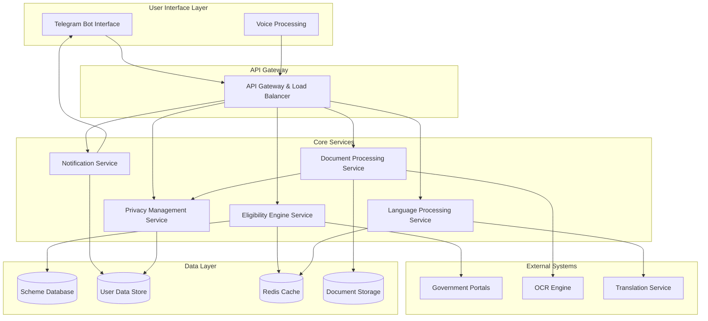

# Design Document: Government Scheme Access Assistant

## Overview

The Government Scheme Access Assistant is a privacy-first Telegram bot that democratizes access to government welfare schemes for India's underserved populations. The system employs a microservices architecture with local document processing, intelligent eligibility matching, and multi-lingual support to guide users through scheme discovery and application processes.

The design prioritizes data privacy, regulatory compliance, and accessibility while maintaining high performance and scalability. The bot processes user documents locally, extracts relevant information for scheme matching, and provides personalized recommendations with step-by-step application guidance.

## Architecture

The system follows a microservices architecture with clear separation of concerns, enabling independent scaling and maintenance of different components.



### Architectural Principles

1. **Privacy by Design**: All sensitive data processing occurs locally with minimal external API calls
2. **Microservices**: Independent, scalable services with well-defined interfaces
3. **Event-Driven**: Asynchronous processing for document analysis and notifications
4. **Caching Strategy**: Multi-layer caching for scheme data and user sessions
5. **Graceful Degradation**: Offline capabilities and fallback mechanisms
6. **Compliance First**: Built-in privacy controls and audit logging

## Components and Interfaces

### Telegram Bot Interface

The primary user interaction layer that handles all Telegram-specific communication protocols.

**Responsibilities:**
- Message routing and session management
- File upload handling and validation
- User authentication and rate limiting
- Webhook management for real-time updates

**Key Interfaces:**
```typescript
interface TelegramBotService {
  handleMessage(update: TelegramUpdate): Promise<void>
  sendMessage(chatId: string, message: LocalizedMessage): Promise<void>
  handleDocument(chatId: string, document: TelegramDocument): Promise<void>
  setWebhook(url: string): Promise<boolean>
}
```

### Document Processing Service

Handles document upload, OCR processing, and information extraction with privacy protection.

**Responsibilities:**
- Image preprocessing and quality validation
- OCR text extraction from government documents
- Information parsing and structured data extraction
- PII masking and privacy protection
- Document type classification

**Key Interfaces:**
```typescript
interface DocumentProcessor {
  processDocument(document: UploadedDocument): Promise<ExtractedInfo>
  validateDocumentQuality(image: Buffer): Promise<QualityScore>
  extractAadhaarInfo(ocrText: string): Promise<AadhaarInfo>
  extractRationCardInfo(ocrText: string): Promise<RationCardInfo>
  extractIncomeInfo(ocrText: string): Promise<IncomeInfo>
}
```

### Eligibility Engine Service

Core business logic for scheme matching and eligibility assessment.

**Responsibilities:**
- Rule-based eligibility evaluation
- ML-driven scheme recommendations
- Eligibility scoring and ranking
- Scheme criteria validation
- User profile analysis

**Key Interfaces:**
```typescript
interface EligibilityEngine {
  evaluateEligibility(profile: UserProfile): Promise<EligibilityResult[]>
  rankSchemes(schemes: SchemeMatch[]): Promise<RankedScheme[]>
  checkPartialEligibility(profile: UserProfile, scheme: Scheme): Promise<PartialMatch>
  suggestImprovements(profile: UserProfile): Promise<Suggestion[]>
}
```

### Language Processing Service

Handles multi-lingual communication and content localization.

**Responsibilities:**
- Language detection and preference management
- Content translation and localization
- Voice-to-text processing
- Cultural adaptation of messaging
- Technical term simplification

**Key Interfaces:**
```typescript
interface LanguageProcessor {
  detectLanguage(text: string): Promise<LanguageCode>
  translateContent(content: string, targetLang: LanguageCode): Promise<string>
  processVoiceMessage(audio: Buffer): Promise<string>
  simplifyTechnicalTerms(text: string, lang: LanguageCode): Promise<string>
}
```

### Privacy Management Service

Ensures data protection compliance and privacy controls.

**Responsibilities:**
- PII identification and masking
- Data retention policy enforcement
- Audit logging and compliance reporting
- User consent management
- Data deletion and anonymization

**Key Interfaces:**
```typescript
interface PrivacyManager {
  maskSensitiveData(data: ExtractedInfo): Promise<MaskedInfo>
  enforceRetentionPolicy(): Promise<void>
  logDataAccess(userId: string, operation: string): Promise<void>
  deleteUserData(userId: string): Promise<boolean>
  anonymizeData(data: UserData): Promise<AnonymizedData>
}
```

### Notification Service

Manages user communications, reminders, and follow-ups.

**Responsibilities:**
- Scheduled notification delivery
- Follow-up reminder management
- Notification preference handling
- Message queuing and retry logic
- Delivery status tracking

**Key Interfaces:**
```typescript
interface NotificationService {
  scheduleReminder(userId: string, reminder: ReminderConfig): Promise<string>
  sendFollowUp(userId: string, application: Application): Promise<void>
  updatePreferences(userId: string, prefs: NotificationPrefs): Promise<void>
  cancelScheduledNotifications(userId: string): Promise<void>
}
```

## Data Models

### User Profile Model

Represents extracted and processed user information for eligibility assessment.

```typescript
interface UserProfile {
  userId: string
  personalInfo: {
    name: string
    age: number
    gender: Gender
    maskedAadhaar: string // Only last 4 digits
  }
  addressInfo: {
    state: string
    district: string
    pincode: string
    ruralUrban: LocationType
  }
  familyInfo: {
    familySize: number
    dependents: number
    rationCardType: RationCardType
    maskedRationCard: string
  }
  economicInfo: {
    annualIncome: number
    incomeSource: IncomeSource
    belowPovertyLine: boolean
  }
  preferences: {
    language: LanguageCode
    notificationFrequency: NotificationFrequency
    communicationMode: CommunicationMode
  }
  createdAt: Date
  lastUpdated: Date
  dataRetentionExpiry: Date
}
```

### Scheme Model

Represents government scheme information and eligibility criteria.

```typescript
interface Scheme {
  schemeId: string
  name: LocalizedString
  description: LocalizedString
  category: SchemeCategory
  level: GovernmentLevel // Central, State, District
  state?: string // For state-specific schemes
  
  eligibilityCriteria: {
    ageRange?: { min: number, max: number }
    genderRestriction?: Gender
    incomeLimit?: number
    locationRestriction?: LocationCriteria
    familySizeLimit?: number
    rationCardTypes?: RationCardType[]
    customCriteria?: CustomCriterion[]
  }
  
  benefits: {
    type: BenefitType
    amount?: number
    description: LocalizedString
    duration?: string
  }
  
  applicationProcess: {
    requiredDocuments: DocumentType[]
    steps: ApplicationStep[]
    onlinePortal?: string
    offlineProcess?: string
    processingTime: string
  }
  
  isActive: boolean
  lastUpdated: Date
  source: string // Government portal URL
}
```

### Application Tracking Model

Tracks user applications and their progress through the system.

```typescript
interface Application {
  applicationId: string
  userId: string
  schemeId: string
  status: ApplicationStatus
  
  progress: {
    currentStep: number
    totalSteps: number
    completedSteps: ApplicationStep[]
    nextAction: string
    deadline?: Date
  }
  
  documents: {
    submitted: SubmittedDocument[]
    pending: DocumentType[]
    verified: boolean
  }
  
  timeline: {
    initiated: Date
    lastActivity: Date
    submitted?: Date
    approved?: Date
    rejected?: Date
  }
  
  followUps: {
    scheduled: ScheduledReminder[]
    completed: CompletedFollowUp[]
  }
  
  outcome?: {
    result: ApplicationResult
    reason?: string
    benefitAmount?: number
    enrollmentId?: string
  }
}
```

### Document Processing Model

Represents processed document information with privacy protection.

```typescript
interface ProcessedDocument {
  documentId: string
  userId: string
  documentType: DocumentType
  
  metadata: {
    originalFilename: string
    fileSize: number
    uploadedAt: Date
    processingStatus: ProcessingStatus
  }
  
  extractedInfo: {
    confidence: number
    rawText?: string // Temporarily stored for processing
    structuredData: Record<string, any>
    validationErrors: ValidationError[]
  }
  
  privacy: {
    piiMasked: boolean
    retentionExpiry: Date
    accessLog: AccessLogEntry[]
  }
  
  qualityMetrics: {
    imageQuality: QualityScore
    ocrConfidence: number
    extractionAccuracy: number
  }
}
```

### Notification Model

Manages scheduled and delivered notifications with user preferences.

```typescript
interface Notification {
  notificationId: string
  userId: string
  type: NotificationType
  
  content: {
    title: LocalizedString
    message: LocalizedString
    actionButtons?: ActionButton[]
    priority: Priority
  }
  
  scheduling: {
    scheduledFor: Date
    timezone: string
    recurring?: RecurrencePattern
    maxRetries: number
  }
  
  delivery: {
    status: DeliveryStatus
    attempts: DeliveryAttempt[]
    deliveredAt?: Date
    readAt?: Date
  }
  
  context: {
    applicationId?: string
    schemeId?: string
    reminderType?: ReminderType
    metadata: Record<string, any>
  }
}
```

Now I need to use the prework tool to analyze the acceptance criteria before writing the Correctness Properties section.

<function_calls>
<invoke name="prework">
<parameter name="featureName">government-scheme-assistant
