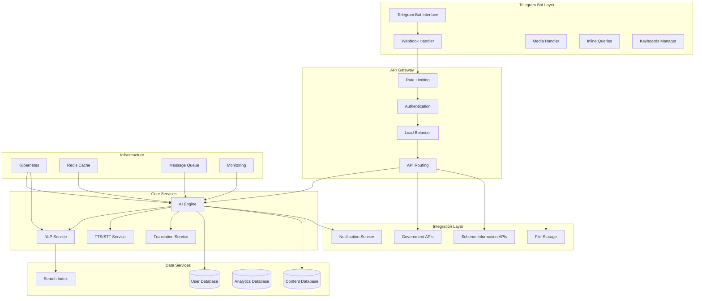

# AI Civic Helpdesk for Government Services - Design Document

## System Architecture

### High-Level Architecture



### Microservices Architecture

#### Core Services
1. **Telegram Bot Service**
   - Webhook handling for incoming messages
   - Message parsing and routing
   - Rich media processing (photos, documents, voice)
   - Inline keyboard and quick reply management
   - Bot command processing

2. **AI Conversation Service**
   - Natural language understanding
   - Intent recognition and entity extraction
   - Context management and conversation flow
   - Response generation and formatting

3. **Multilingual Processing Service**
   - Language detection from user messages
   - Translation services
   - Localized content management
   - Cultural context adaptation

4. **Voice Processing Service**
   - Voice message transcription
   - Text-to-speech for voice responses
   - Audio quality optimization
   - Voice command recognition

5. **Content Management Service**
   - Government service information
   - Document requirements database
   - Eligibility criteria engine
   - Policy update management

6. **User Management Service**
   - Telegram user authentication
   - Profile management and preferences
   - Session state management
   - User analytics and tracking

## Telegram Bot Architecture

### Bot Framework Structure


### Conversation Flow Management

#### State Machine Design


## Component Design

### AI Engine Architecture


### Data Architecture

#### Database Design

**User Database (PostgreSQL)**
```sql
-- Users table (Telegram-specific, minimal data)
CREATE TABLE users (
    user_id BIGINT PRIMARY KEY, -- Telegram user ID
    telegram_username VARCHAR(50),
    preferred_language VARCHAR(10),
    bot_state VARCHAR(50), -- current conversation state
    session_data JSONB, -- temporary session data only
    created_at TIMESTAMP,
    last_active TIMESTAMP
);

-- Conversations table (temporary, auto-cleanup)
CREATE TABLE conversations (
    conversation_id UUID PRIMARY KEY,
    telegram_user_id BIGINT REFERENCES users(user_id),
    chat_id BIGINT, -- Telegram chat ID
    started_at TIMESTAMP,
    ended_at TIMESTAMP,
    status VARCHAR(20),
    expires_at TIMESTAMP -- auto-cleanup after 24 hours
);

-- Messages table (temporary, no personal content stored)
CREATE TABLE messages (
    message_id UUID PRIMARY KEY,
    conversation_id UUID REFERENCES conversations(conversation_id),
    telegram_message_id INTEGER, -- Telegram message ID
    sender VARCHAR(10), -- user, bot
    message_type VARCHAR(20), -- text, voice, photo, document
    language VARCHAR(10),
    timestamp TIMESTAMP,
    expires_at TIMESTAMP -- auto-cleanup after 24 hours
);
```

**Content Database (MongoDB)**
```javascript
// Government Services Collection
{
  _id: ObjectId,
  service_id: "aadhaar_new",
  name: {
    en: "New Aadhaar Registration",
    hi: "नया आधार पंजीकरण",
    // other languages
  },
  description: {
    en: "Apply for new Aadhaar card...",
    hi: "नया आधार कार्ड के लिए आवेदन...",
  },
  category: "identity_documents",
  eligibility_criteria: [
    {
      condition: "age >= 0",
      description: "Available for all ages"
    }
  ],
  required_documents: [
    {
      document_type: "proof_of_identity",
      options: ["birth_certificate", "school_certificate"],
      mandatory: true
    }
  ],
  process_steps: [
    {
      step_number: 1,
      description: "Visit nearest Aadhaar center",
      estimated_time: "30 minutes"
    }
  ],
  fees: {
    amount: 0,
    currency: "INR",
    payment_schemes: ["free", "subsidized", "full_fee"],
    scheme_details: {
      free: "Available for BPL families",
      subsidized: "50% discount for senior citizens",
      full_fee: "Standard processing fee"
    }
  },
  processing_time: "90 days",
  last_updated: ISODate()
}
```

## User Journey and Experience Flow

### Complete User Journey

```mermaid
flowchart TD
    START([User Discovers Bot]) --> FIRST[First Interaction: /start]
    FIRST --> WELCOME[Welcome Message & Language Selection]
    
    WELCOME --> LANG{Select Language}
    LANG --> HINDI[हिंदी Selected]
    LANG --> ENGLISH[English Selected]
    LANG --> OTHER[Other Language Selected]
    
    HINDI --> MENU[Main Service Menu]
    ENGLISH --> MENU
    OTHER --> MENU
    
    MENU --> CHOICE{User Choice}
    
    CHOICE -->|Browse Services| BROWSE[Service Categories]
    CHOICE -->|Check Eligibility| ELIGIBILITY[Eligibility Checker]
    CHOICE -->|Ask Question| QUESTION[Free Text Query]
    CHOICE -->|Upload Document| UPLOAD[Document Upload]
    
    BROWSE --> CATEGORY[Select Category]
    CATEGORY --> SERVICE[Select Specific Service]
    SERVICE --> DETAILS[Service Details & Requirements]
    
    ELIGIBILITY --> FORM[Eligibility Form]
    FORM --> RESULT[Eligibility Result]
    RESULT --> RECOMMEND[Service Recommendations]
    
    QUESTION --> NLP[Process Natural Language]
    NLP --> UNDERSTAND[Intent Recognition]
    UNDERSTAND --> ANSWER[Generate Answer]
    
    UPLOAD --> VERIFY[Document Verification]
    VERIFY --> FEEDBACK[Verification Feedback]
    
    DETAILS --> ACTION{Next Action}
    RECOMMEND --> ACTION
    ANSWER --> ACTION
    FEEDBACK --> ACTION
    
    ACTION -->|Get Fee Info| FEES[Fee & Scheme Information]
    ACTION -->|More Info| INFO[Additional Information]
    ACTION -->|Find Office| LOCATION[Office Locator]
    ACTION -->|Ask More| MENU
    ACTION -->|End| END([Session End])
    
    FEES --> MENU
    INFO --> MENU
    LOCATION --> MENU
    END
```



### Service Discovery Flow


## User Interface/Experience Design

### Conversational UI Principles

#### Design Philosophy
- **Simplicity First**: Minimize cognitive load with clear, concise responses
- **Cultural Sensitivity**: Respect local customs and communication styles
- **Accessibility**: Support for users with disabilities and varying tech literacy
- **Progressive Disclosure**: Reveal information gradually to avoid overwhelming users

#### Conversation Flow Design

```
User Input → Language Detection → Intent Classification → Context Analysis
     ↓
Response Generation → Personalization → Multi-modal Output → User Feedback
     ↓
Context Update → Analytics Logging → Conversation Continuation
```

### Telegram Bot Interface Design

#### Bot Commands Structure
```
/start - Initialize bot and language selection
/help - Show available commands and features
/services - Browse government services
/eligibility - Check eligibility for schemes
/documents - Get document requirements
/fees - Get fee information and payment schemes
/track - Track application status
/language - Change language preference
/feedback - Provide feedback
/support - Contact human support
```

#### Interactive Elements

**Inline Keyboards for Service Categories:**
```
┌─────────────────────────────────┐
│ 🏛️ AI Civic Helpdesk Bot        │
├─────────────────────────────────┤
│ Welcome! Choose a service:      │
│                                 │
│ [📄 Identity Documents]         │
│ [🏠 Housing & Property]         │
│ [💰 Financial Services]         │
│ [🌾 Agriculture & Rural]        │
│ [👥 Social Welfare]             │
│ [🎓 Education]                  │
│                                 │
│ Or type your question directly! │
└─────────────────────────────────┘
```

**Quick Reply Keyboards:**
```
┌─────────────────────────────────┐
│ Select your preferred language: │
│                                 │
│ [🇮🇳 हिंदी] [🇬🇧 English]      │
│ [🇹🇦 தமிழ்] [🇹🇪 తెలుగు]       │
│ [🇧🇩 বাংলা] [🇲🇭 मराठी]       │
│                                 │
│ [⚙️ More Languages...]          │
└─────────────────────────────────┘
```

#### Rich Media Responses

**Document Checklist with Images:**
```
┌─────────────────────────────────┐
│ 📋 Aadhaar Card Requirements    │
├─────────────────────────────────┤
│ Required Documents:             │
│                                 │
│ ✅ Proof of Identity:           │
│ • Birth Certificate             │
│ • School Certificate            │
│ • Passport                      │
│                                 │
│ ✅ Proof of Address:            │
│ • Utility Bill                  │
│ • Bank Statement                │
│ • Rent Agreement                │
│                                 │
│ [📷 Upload Documents]           │
│ [📍 Find Center] [💬 Ask Query] │
└─────────────────────────────────┘
```

## Data Flow Diagrams

### Telegram Bot Processing Flow


### Integration Data Flow


## Technology Choices and Justification

### Telegram Bot Technology Stack

#### Node.js with Telegraf.js Framework
**Justification:**
- Telegraf.js is the most popular and well-maintained Telegram bot framework
- Excellent middleware support for session management and scene handling
- Built-in support for inline keyboards, webhooks, and file handling
- Strong TypeScript support for better development experience
- Active community and comprehensive documentation

#### Telegram Bot API Integration
**Justification:**
- Native support for rich media (photos, documents, voice messages)
- Inline keyboards and custom keyboards for better UX
- Built-in payment processing capabilities
- File upload/download with automatic handling
- Webhook support for real-time message processing

#### Redis for Session Management
**Justification:**
- Perfect for managing bot conversation states
- Fast session storage for multi-step conversations
- Built-in expiration for temporary data
- Excellent integration with Telegraf.js sessions

#### PostgreSQL + MongoDB Hybrid
**Justification:**
- PostgreSQL for structured user data and transactions
- MongoDB for flexible content management and conversation logs
- Both offer excellent scalability and reliability
- Strong JSON support for multilingual content

#### Redis for Caching
**Justification:**
- In-memory performance for session management
- Pub/Sub capabilities for real-time features
- Excellent for rate limiting and API throttling
- Supports complex data structures

### AI/ML Technology Stack

#### Google Dialogflow ES/CX
**Justification:**
- Built-in multilingual support
- Excellent NLP capabilities for Indian languages
- Easy integration with Google Cloud services
- Robust intent recognition and entity extraction

#### Google Cloud Speech-to-Text/Text-to-Speech
**Justification:**
- Superior accuracy for Indian accents and languages
- Real-time streaming capabilities
- Cost-effective pricing model
- Seamless integration with other Google services

#### Custom ML Models (TensorFlow)
**Justification:**
- Fine-tuned models for government domain terminology
- Better accuracy for specific use cases
- Data privacy and control
- Ability to train on local datasets

### Infrastructure Choices

#### Google Cloud Platform
**Justification:**
- Excellent AI/ML services ecosystem
- Strong presence in India with local data centers
- Government-friendly compliance and security features
- Cost-effective for startups and scaling

#### Kubernetes for Orchestration
**Justification:**
- Excellent for microservices architecture
- Auto-scaling capabilities
- High availability and fault tolerance
- Industry standard for container orchestration

## Implementation Approach

### Phase 1: Telegram Bot MVP (4-6 weeks)
**Core Features:**
- Basic Telegram bot with command handling
- Text-based conversations in English and Hindi
- Essential government services database (top 10 services)
- Inline keyboards for service navigation
- Basic user state management

**Technical Implementation:**
- Set up Telegraf.js bot framework
- Implement webhook handling
- Create basic conversation flows
- Set up PostgreSQL database
- Deploy on cloud with webhook endpoint

### Phase 2: Enhanced Bot Features (6-8 weeks)
**Additional Features:**
- Voice message processing
- 5 additional Indian languages
- Rich media responses (images, documents)
- File upload for document verification
- Advanced inline keyboards and quick replies

**Technical Implementation:**
- Integrate speech processing services
- Implement file handling capabilities
- Create rich response templates
- Add multilingual content management
- Enhanced conversation state management

### Phase 3: Advanced Integration (8-10 weeks)
**Advanced Features:**
- Government API integrations
- Document verification through photos
- Fee and scheme information system
- Advanced analytics dashboard for administrators

**Technical Implementation:**
- Complex third-party API integrations
- Image processing for document verification
- Comprehensive scheme database
- Analytics and monitoring dashboard
- Advanced security measures

### Phase 4: Scale and Optimize (4-6 weeks)
**Optimization:**
- Performance tuning for high message volume
- Advanced caching strategies
- Load testing with multiple concurrent users
- Security hardening
- User feedback integration and bot improvements

## Scalability Considerations

### Telegram Bot Scaling Strategy

#### Bot Instance Scaling
- **Webhook Load Balancing**: Multiple bot instances behind load balancer
- **Message Queue**: Redis-based queue for handling high message volume
- **Session Clustering**: Distributed session storage across instances
- **File Processing**: Separate service for handling media uploads

#### Database Scaling
- **Read Replicas**: For content database queries
- **User Sharding**: Telegram user ID-based sharding
- **Conversation Archiving**: Move old conversations to cold storage
- **Cache Strategy**: Multi-layer caching for frequent queries

#### Telegram API Optimization
- **Rate Limit Management**: Intelligent request throttling
- **Batch Operations**: Group multiple API calls where possible
- **Webhook Optimization**: Efficient webhook processing
- **Media CDN**: Content delivery network for bot media files

### Performance Optimization

#### Caching Strategy


#### Database Optimization
- Indexing strategy for frequent queries
- Query optimization and monitoring
- Connection pooling
- Database partitioning by service type

## Security and Privacy Measures

### Data Protection Framework

#### Privacy by Design
- **No Personal Data Storage**: Only temporary session data stored
- **Data Minimization**: Collect only necessary information for current session
- **Automatic Cleanup**: All session data expires and is deleted within 24 hours
- **Anonymous Analytics**: Usage patterns tracked without personal identifiers

#### Session Management
- **Temporary Storage**: User preferences and conversation state only
- **Auto-Expiry**: All data automatically deleted after session ends
- **No Persistence**: No long-term user data retention
- **Secure Sessions**: Encrypted session tokens with short expiry

### Security Architecture

#### Authentication and Authorization


#### API Security
- Rate limiting and throttling
- API key management
- Request/response validation
- SQL injection prevention
- XSS protection

#### Infrastructure Security
- Network segmentation
- Firewall configuration
- Intrusion detection systems
- Regular security audits
- Vulnerability assessments

### Compliance Framework

#### Privacy Standards
- No personal data storage compliance
- Session-only data handling
- Anonymous usage analytics
- Automatic data cleanup policies

#### International Standards
- ISO 27001 for information security
- SOC 2 Type II compliance
- Privacy by design principles
- WCAG 2.1 AA for accessibility

## Monitoring and Analytics

### System Monitoring
- **Application Performance Monitoring (APM)**
- **Infrastructure monitoring**
- **Real-time alerting**
- **Log aggregation and analysis**

### User Analytics
- **Conversation analytics**
- **User journey mapping**
- **Service usage patterns**
- **Satisfaction metrics**

### Business Intelligence
- **Service effectiveness metrics**
- **User demographic analysis**
- **Regional usage patterns**
- **Impact measurement**

This design document provides a comprehensive blueprint for building a scalable, secure, and user-friendly AI Civic Helpdesk that can significantly improve citizen access to government services in India.
